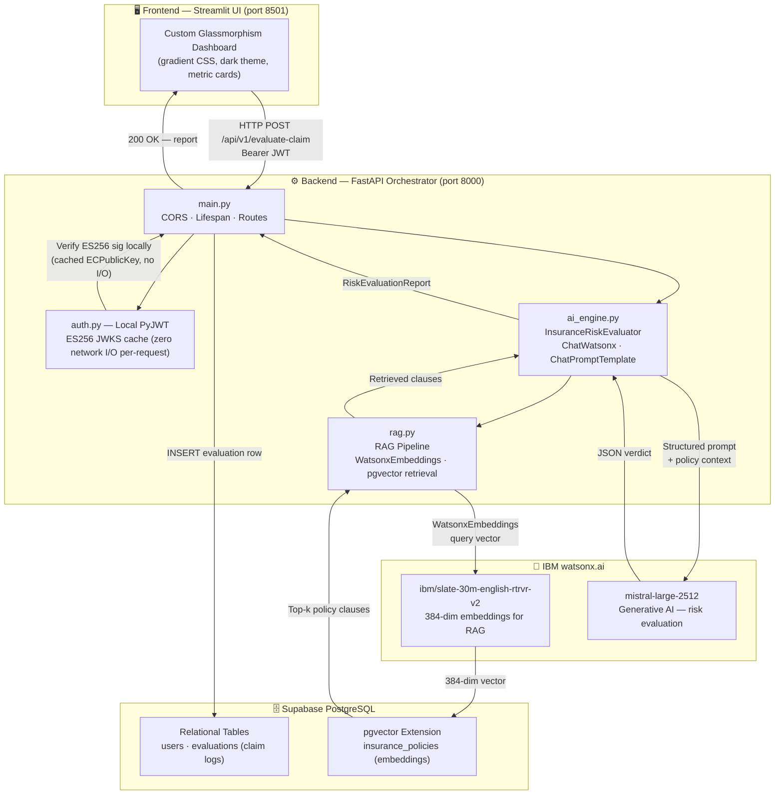

# 🛡️ Insurance AI Orchestrator
### Enterprise-Grade AI Risk Underwriting Orchestrator
#### IBM AI Builders Hackathon — Submission

> **Bridging advanced data engineering with practical actuarial science — real-time life insurance claim risk evaluation powered by IBM watsonx.ai (Mistral Large + Granite Embeddings), orchestrated through a secure FastAPI backend with zero-latency local JWT auth, Supabase PostgreSQL + pgvector persistence, and a premium glassmorphism Streamlit dashboard.**

---

## 📌 Selected Challenge Theme

**Insurance Claims & Risk Workflow Automation (Wildcard Challenge)**

This project addresses the end-to-end automation of life insurance claim intake, risk scoring, fraud detection, and underwriter decision support — replacing slow, error-prone manual review with an AI-driven, RAG-augmented evaluation pipeline that delivers a structured actuarial verdict in seconds.

---

## 🔍 Problem Statement

Manual life insurance underwriting is a multi-billion dollar bottleneck:

- **Speed** — Senior underwriters can review only a handful of complex claims per day. Queues compound rapidly during high-volume periods.
- **Consistency** — Human reviewers apply rules inconsistently. Fatigue, cognitive bias, and varying experience levels mean identical claims receive different verdicts depending on who reviews them.
- **Pattern blindness** — Multi-factor fraud requires evaluating claim amount, policy tenure, diagnosis codes, and policyholder income *simultaneously*. This is cognitively expensive at scale.
- **Specific failure modes** routinely missed by manual review:
  - **Financial Anti-Selection** — claim benefit far exceeds the policyholder's actuarial need (claim-to-income ratio > 5×).
  - **Early Claim Fraud** — a major claim filed within the first 12 months of policy inception; a strong indicator the policy was obtained with fraudulent intent.
  - **Material Misrepresentation** — a serious diagnosis claimed with no matching pre-existing condition declared at application time.
  - **The High-Risk Triangle** — age > 65, policy tenure < 36 months, and a large claim amount co-occurring simultaneously.

The industry needs a system that applies these rules *holistically*, *every time*, *at scale* — and cites the specific internal policy clauses it relied upon.

---

## 💡 Solution

**Insurance AI Orchestrator** is a production-architected full-stack application that automates the first-pass underwriting decision for life insurance claims:

1. An underwriter submits a claim and policyholder profile via the secure Streamlit dashboard.
2. The **FastAPI backend** validates the JWT, constructs a structured actuarial prompt, and dynamically retrieves relevant internal policy clauses from **Supabase pgvector** using IBM Slate embeddings.
3. The **IBM watsonx.ai** Mistral Large model evaluates the claim holistically against domain-specific underwriting rules *and* the retrieved policy citations, returning a structured JSON verdict.
4. The verdict is **persisted to Supabase PostgreSQL** and rendered instantly on the dashboard with colour-coded banners, metric cards, anomaly pills, and a full reasoning panel.

### Verdict schema

| Field | Type | Description |
|---|---|---|
| `risk_score` | `float [0.0–1.0]` | 0.0 = safe, 1.0 = high-risk / fraud |
| `flagged_anomalies` | `list[str]` | Specific red flags detected |
| `recommendation` | `enum` | `Approve` · `Escalate to Underwriter` · `Reject` |
| `ai_reasoning` | `str` | Concise natural-language explanation grounded in policy clauses |

---

## 🏗️ Architecture



---

## 🚀 Development Journey

### Phase 1 — Full-Stack & UI Foundation

The first phase established the complete end-to-end skeleton: a **FastAPI** backend exposing a single POST endpoint (`/api/v1/evaluate-claim`), wired to a **Streamlit** frontend that sends structured claim + profile data and renders the AI verdict.

The frontend required significant CSS work to escape Streamlit's default styling. The entire glassmorphism design system was built through `st.markdown(..., unsafe_allow_html=True)` injections targeting Streamlit's internal `data-testid` attribute selectors — the only reliable way to restyle core widgets without breaking component rendering:

- **Input widgets**: `rgba(255,255,255,0.05)` semi-transparent backgrounds, `backdrop-filter: blur(10px)`, glowing focus rings on interaction.
- **Metric cards**: Frosted-glass tiles with layered `box-shadow` depth and hover lift animation.
- **Verdict banners**: Rich gradient `<div>` blocks (deep green / amber / crimson red) replacing `st.success/warning/error`, preserving the full premium feel.
- **Full-page backdrop**: Radial gradient dark theme, configured in `frontend/.streamlit/config.toml` (`primaryColor: #00AEEF`, `backgroundColor: #0E1117`).

FastAPI's lifespan pattern was used to initialise the `InsuranceRiskEvaluator` **once at startup**, avoiding repeated IBM Cloud auth overhead on every request. Structured error handling separates `ValueError` (malformed LLM output → HTTP 502) from `RuntimeError` (watsonx API failure → HTTP 503).

---

### Phase 2 — Auth Optimization & Database Layer

The second phase introduced **Supabase** as the persistence and identity layer, with a key architectural decision around authentication performance.

#### Auth: Migrating to Zero-Latency Local JWT Verification

Rather than routing each API request through Supabase's auth service (which introduces a network round-trip per call), the backend was migrated to **local PyJWT verification** using ES256 asymmetric cryptography:

- At startup, `init_jwks()` fetches the EC public key **once** from `{SUPABASE_URL}/auth/v1/.well-known/jwks.json` and caches it in an in-memory `{kid: ECPublicKey}` dict.
- On every subsequent request, `verify_token()` verifies the Bearer token **purely in CPU** — `jwt.decode()` with the cached EC public key. **Zero network I/O per request.**
- This caching architecture means auth latency is measured in microseconds, not milliseconds, and the system is resilient to any transient Supabase auth service degradation.
- Supabase projects created after ~2024 use ES256 by default, so no `SUPABASE_JWT_SECRET` is needed — the public key is sufficient for verification.

#### Database: Relational + Vector

Two distinct storage concerns are handled by Supabase:

| Table | Purpose |
|---|---|
| `evaluations` | Relational audit log — every claim evaluation (claim_id, policy_id, risk_score, recommendation, anomalies, reasoning) is persisted for auditor review |
| `insurance_policies` | pgvector embeddings store — internal policy documents chunked and indexed for semantic retrieval |

DB writes are fire-and-forget: a failure to persist an evaluation **never blocks** the API response returned to the user — it is logged and the 200 OK is returned regardless.

---

### Phase 3 — Actuarial AI & RAG Engine

The third phase delivered the core AI capability: a **Retrieval-Augmented Generation** pipeline that grounds every evaluation in specific, citable internal policy rules.

#### RAG Pipeline (`backend/app/rag.py`)

1. **Document ingestion**: Internal policy documents (`.txt` / `.pdf`) in `backend/app/documents/` are loaded, chunked with `RecursiveCharacterTextSplitter` (500-char chunks, 50-char overlap), and uploaded to the `insurance_policies` Supabase table via `SupabaseVectorStore`.
2. **Embedding model**: `ibm/slate-30m-english-rtrvr-v2` (384 dimensions) via `WatsonxEmbeddings`. This IBM-native model produces compact, high-quality embeddings tuned for retrieval tasks.
3. **Retrieval**: At evaluation time, a query is constructed from the claim's diagnosis codes, amount, and policy tenure. `similarity_search(query, k=3)` retrieves the most relevant policy clauses from pgvector using the `match_policies` RPC.

#### AI Engine (`backend/app/ai_engine.py`)

The retrieved clauses are injected into a `ChatPromptTemplate` alongside the full claim and policyholder profile, forming a richly contextualised prompt for `mistral-large-2512`:

**Risk variables evaluated holistically:**

| Rule | Signal |
|---|---|
| Financial Anti-Selection | `claim_amount > 5 × annual_income` |
| Early Claim | `months_since_inception < 12` |
| Material Misrepresentation | Major diagnosis code present but no matching `medical_history_flags` declared at application |
| **The High-Risk Triangle** | `age > 65` AND `months_since_inception < 36` AND large claim amount — simultaneous co-occurrence |

The model is prompted to reason against these rules **and** the dynamically retrieved policy clauses, then return a strict JSON object. Temperature is locked at `0.0` for fully deterministic, parseable output. All four response fields are validated before the response is returned, with a strict allowlist guard on `recommendation` to prevent hallucinated verdict values.

---

## 🛠️ Tech Stack

| Layer | Technology | Version |
|---|---|---|
| Frontend | Streamlit | 1.59.1 |
| Backend | FastAPI + Uvicorn | 0.139.0 / 0.30.1 |
| Data validation | Pydantic | 2.13.4 |
| Authentication | PyJWT (local ES256 verification) | 2.x |
| AI orchestration | LangChain + langchain-ibm | 1.3.x / 1.1.0 |
| IBM AI SDK | ibm-watsonx-ai | 1.5.14 |
| Embeddings | ibm/slate-30m-english-rtrvr-v2 | — |
| LLM | Mistral Large (via watsonx.ai) | mistral-large-2512 |
| Database | Supabase PostgreSQL + pgvector | — |
| Vector store | LangChain SupabaseVectorStore | — |
| Language | Python | 3.12 |

---

## ⚙️ Setup & Running

### Required Environment Variables

Copy `backend/.env.example` to `backend/.env` and fill in your values:

```env
# IBM watsonx.ai
WATSONX_API_KEY=your-ibm-cloud-api-key
WATSONX_URL=https://us-south.ml.cloud.ibm.com
WATSONX_PROJECT_ID=your-watsonx-project-id

# Supabase (backend uses service_role key for DB writes)
SUPABASE_URL=https://<project-ref>.supabase.co
SUPABASE_KEY=your-supabase-service-role-key

# No SUPABASE_JWT_SECRET needed — the backend fetches the ES256
# public key automatically from {SUPABASE_URL}/auth/v1/.well-known/jwks.json
```

The Streamlit frontend uses the Supabase **anon** public key (only needs to call Supabase Auth for sign-in/sign-out — it never writes to the database directly). Configure it in `frontend/.streamlit/secrets.toml` or your deployment environment.

### Installation

```powershell
# From the repo root — one virtual environment for everything
cd backend
python -m venv .venv
.venv\Scripts\pip install -r requirements.txt
```

### Running the Application

**Terminal 1 — FastAPI backend:**
```powershell
backend\.venv\Scripts\python.exe backend\run.py
# → http://localhost:8000
# → Swagger UI: http://localhost:8000/docs
```

**Terminal 2 — Streamlit frontend:**
```powershell
backend\.venv\Scripts\streamlit.exe run frontend\app.py
# → http://localhost:8501
```

### (Optional) Ingest Policy Documents

Place `.txt` or `.pdf` policy documents in `backend/app/documents/`, then call the ingest endpoint to chunk and upload embeddings to Supabase pgvector:

```powershell
# Via the Swagger UI at http://localhost:8000/docs → POST /api/v1/ingest-documents
# Or directly:
curl -X POST http://localhost:8000/api/v1/ingest-documents \
     -H "Authorization: Bearer <your-supabase-jwt>"
```

### Project Structure

```
insurance-ai-orchestrator/
├── backend/
│   ├── app/
│   │   ├── ai_engine.py        # InsuranceRiskEvaluator — LLM chain, RAG, JSON parsing
│   │   ├── auth.py             # Local ES256 JWT verification (zero-I/O per request)
│   │   ├── db.py               # Supabase client initialisation
│   │   ├── main.py             # FastAPI app, routes, CORS, lifespan
│   │   ├── models.py           # Pydantic schemas
│   │   ├── rag.py              # pgvector ingest + retrieval pipeline
│   │   └── documents/          # Internal policy docs for RAG ingestion
│   ├── .env                    # Secrets (git-ignored)
│   ├── .env.example            # Reference template
│   ├── requirements.txt
│   └── run.py                  # Uvicorn launcher
└── frontend/
    ├── .streamlit/
    │   └── config.toml         # Dark theme configuration
    ├── app.py                  # Streamlit dashboard
    └── requirements.txt
```

---

## 🤖 How IBM Bob Was Used

Bob (IBM's AI coding assistant) was an active pair-programmer throughout this project. Key contributions:

**Backend scaffolding** — Designed the three-layer model structure (`ClaimSubmission` → `InsuranceRiskEvaluator` → `RiskEvaluationReport`), the FastAPI lifespan pattern, and CORS middleware configuration.

**Dependency conflict resolution** — Diagnosed and resolved a critical `starlette` version conflict between Streamlit and FastAPI, and a `model_no_support_for_function` error caused by using `WatsonxLLM` (text generation) with a chat-only model — rewriting the chain to use `ChatWatsonx` with `ChatPromptTemplate`.

**CSS engineering** — Wrote all custom glassmorphism CSS injected via `st.markdown`, targeting Streamlit's internal `data-testid` selectors to apply styling without breaking component rendering.

**Auth architecture** — Designed and implemented the local ES256 JWT verification system with JWKS caching, replacing per-request Supabase auth round-trips with zero-latency in-memory key lookups.

**RAG pipeline** — Built the full `rag.py` ingestion and retrieval pipeline connecting IBM Slate embeddings, LangChain's `SupabaseVectorStore`, and the Supabase pgvector `match_policies` RPC.

---

## 👤 About the Developer

The actuarial logic, underwriting rules, and risk variable selection in this project are not hypothetical — they are grounded in real-world domain expertise.

The architectural decisions around fraud detection patterns (Financial Anti-Selection, the High-Risk Triangle, Material Misrepresentation, Early Claims) were informed by direct professional experience gained during a completed internship at **Prudential Life Insurance Ghana**, where these failure modes were encountered in live claims operations. This domain knowledge is paired with ongoing **Actuarial Science studies at the University of Cape Coast**, providing the quantitative and regulatory framework that underpins the risk scoring model.

The result is an AI system designed not just by an engineer, but by someone who has sat on the underwriting side and understands what patterns actually matter — and why.

---

## 📄 License

MIT — see `LICENSE` for details.

---

*Submitted for the IBM AI Builders Hackathon · 2026*
