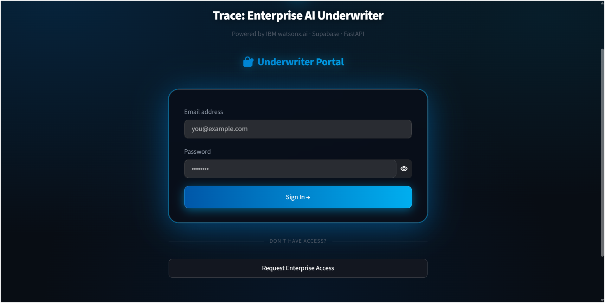
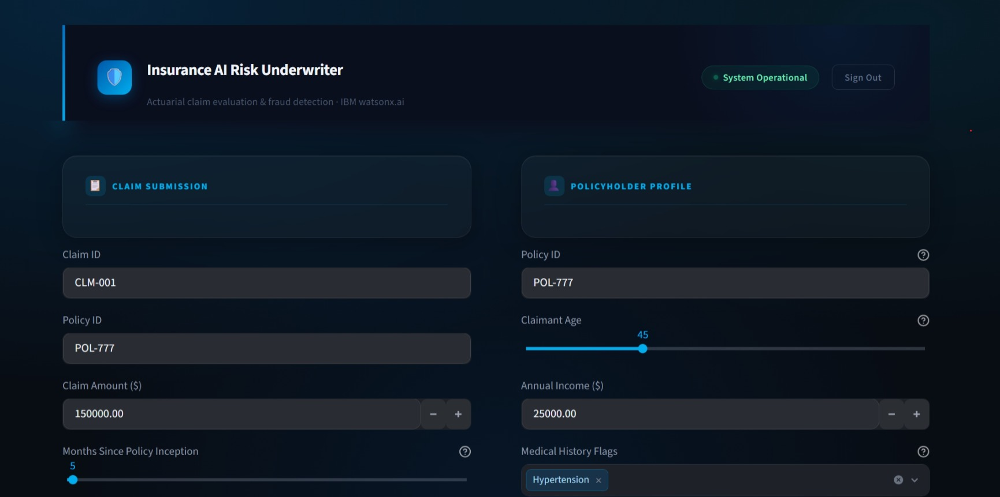
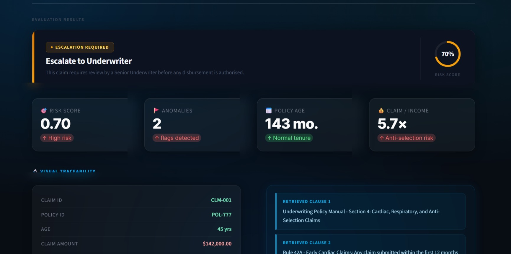
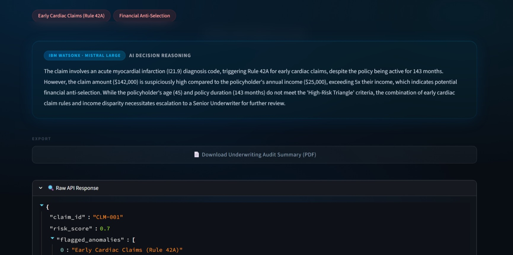
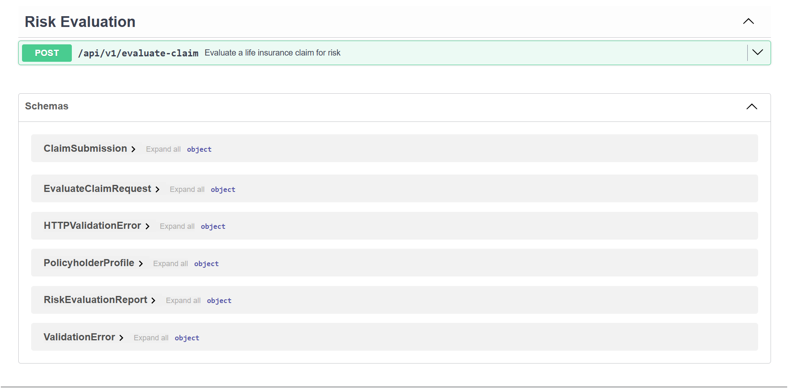
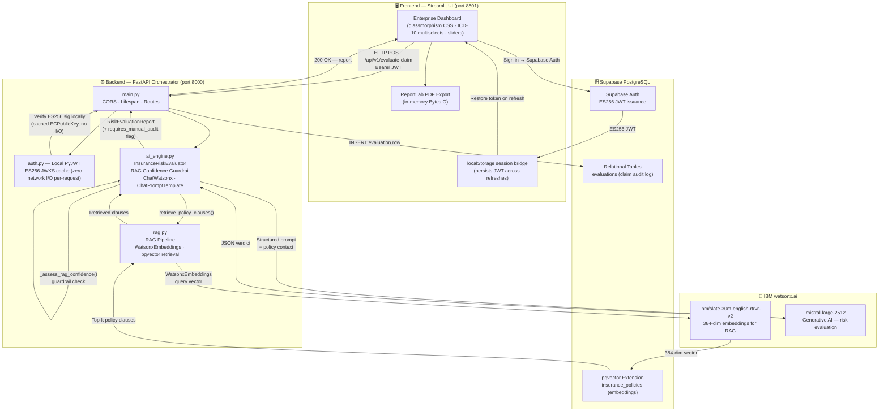

# 🛡️ Trace: Enterprise AI Underwriter
### Enterprise-Grade AI Risk Underwriting Orchestrator
#### IBM AI Builders Hackathon — Submission

> **Bridging advanced data engineering with practical actuarial science — real-time life insurance claim risk evaluation powered by IBM watsonx.ai (Mistral Large + IBM Slate Embeddings), orchestrated through a secure FastAPI backend with zero-latency local JWT auth, Supabase PostgreSQL + pgvector persistence, RAG confidence guardrails, PDF audit export, and a fully custom enterprise Streamlit dashboard.**

---

## 📌 Selected Challenge Theme

**Insurance Claims & Risk Workflow Automation (Wildcard Challenge)**

This project addresses the end-to-end automation of life insurance claim intake, risk scoring, fraud detection, and underwriter decision support — replacing slow, error-prone manual review with an AI-driven, RAG-augmented evaluation pipeline that delivers a structured, citable, exportable actuarial verdict in seconds.

---

## 🔍 Problem Statement

Manual life insurance underwriting is a multi-billion dollar bottleneck:

- **Speed** — Senior underwriters can review only a handful of complex claims per day. Queues compound rapidly during high-volume periods.
- **Consistency** — Human reviewers apply rules inconsistently. Fatigue, cognitive bias, and varying experience levels mean identical claims receive different verdicts depending on who reviews them.
- **Pattern blindness** — Multi-factor fraud requires evaluating claim amount, policy tenure, diagnosis codes, and policyholder income *simultaneously*. This is cognitively expensive at scale.
- **Ungrounded AI decisions** — LLM-based systems that evaluate claims without anchoring to specific internal policy rules produce outputs that cannot be audited or trusted.
- **Specific failure modes** routinely missed by manual review:
  - **Financial Anti-Selection** — claim benefit far exceeds the policyholder's actuarial need (claim-to-income ratio > 5×).
  - **Early Claim Fraud** — a major claim filed within the first 12 months of policy inception; a strong indicator the policy was obtained with fraudulent intent.
  - **Material Misrepresentation** — a serious diagnosis claimed with no matching pre-existing condition declared at application time.
  - **The High-Risk Triangle** — age > 65, policy tenure < 36 months, and a large claim amount co-occurring simultaneously.

The industry needs a system that applies these rules *holistically*, *every time*, *at scale* — cites the specific internal policy clauses it relied upon, and raises a human audit flag when its own reasoning context is insufficient.

---

## 💡 Solution

**Trace: Enterprise AI Underwriter** is a production-architected full-stack application that automates the first-pass underwriting decision for life insurance claims:

1. An underwriter signs in via the Supabase-authenticated Streamlit dashboard (session persists across browser refreshes via a `localStorage` bridge).
2. They submit a claim and policyholder profile using **dropdowns, multiselects, and sliders** — all ICD-10 coded, with a live claim/income ratio indicator.
3. The **FastAPI backend** validates the ES256 JWT locally (zero network I/O), constructs a structured actuarial prompt, and dynamically retrieves relevant internal policy clauses from **Supabase pgvector** using IBM Slate embeddings.
4. A **RAG confidence guardrail** assesses the retrieved context before the LLM call. If the vector store returns insufficient policy-specific content, `requires_manual_audit = True` is set and a high-visibility audit banner is shown in the UI.
5. The **IBM watsonx.ai** Mistral Large model evaluates the claim holistically against domain-specific underwriting rules *and* the retrieved policy citations, returning a strict JSON verdict.
6. The verdict is **persisted to Supabase PostgreSQL**, rendered on the dashboard with a redesigned professional verdict card (SVG risk ring, coloured accent bar, status chip), a **Visual Traceability** panel, anomaly pills, and a full AI reasoning panel.
7. The underwriter can download a **PDF Audit Summary** — generated in-memory with ReportLab — containing all claim data, retrieved clauses, and the AI decision, formatted for file archiving.

---

## 📸 Screenshots

| Sign In | Dashboard |
|---|---|
|  |  |

| Evaluation Results | AI Reasoning |
|---|---|
|  |  |

| Swagger UI |
|---|
|  |

---

## 📊 API Response Schema

`RiskEvaluationReport` — the full response contract:

| Field | Type | Description |
|---|---|---|
| `risk_score` | `float [0.0–1.0]` | 0.0 = safe, 1.0 = high-risk / fraud |
| `flagged_anomalies` | `list[str]` | Specific actuarial red flags detected |
| `recommendation` | `enum` | `Approve` · `Escalate to Underwriter` · `Reject` |
| `ai_reasoning` | `str` | Natural-language explanation grounded in retrieved policy clauses |
| `policy_clauses` | `str \| null` | Raw RAG-retrieved policy text passed to the frontend for traceability |
| `requires_manual_audit` | `bool` | `True` when the RAG context was too weak to trust the automated verdict |
| `audit_reason` | `str \| null` | Human-readable explanation of why the guardrail fired |

---

## 🏗️ Architecture




* 🛡️ **Enterprise Security & Compliance:** See the [SECURITY.md](SECURITY.md) file for our complete V4.0 threat mitigation plan, including LLM firewalls and DLP masking for medical data.


---

## 🚀 Development Journey

### Phase 1 — Full-Stack & UI Foundation

The first phase established the end-to-end skeleton: a **FastAPI** backend exposing a single POST endpoint (`/api/v1/evaluate-claim`), wired to a **Streamlit** frontend that sends structured claim + profile data and renders the AI verdict.

The entire glassmorphism design system was built through `st.markdown(..., unsafe_allow_html=True)` injections targeting Streamlit's internal `data-testid` attribute selectors — the only reliable way to restyle core widgets without breaking component rendering. FastAPI's lifespan pattern initialises the `InsuranceRiskEvaluator` **once at startup**, avoiding repeated IBM Cloud auth overhead on every request.

---

### Phase 2 — Auth Optimization & Database Layer

#### Local ES256 JWT Verification (Zero-Latency Auth)

Rather than routing each API request through Supabase's auth service, the backend uses **local PyJWT verification**:

- At startup, `init_jwks()` fetches the EC public key **once** from `{SUPABASE_URL}/auth/v1/.well-known/jwks.json` and caches it in a `{kid: ECPublicKey}` dict.
- Per-request: `jwt.decode()` against the cached key — **pure CPU, zero network I/O**.
- Supabase projects created after ~2024 use ES256 by default, so no `SUPABASE_JWT_SECRET` is needed.

#### Frontend Session Persistence (localStorage Bridge)

Streamlit's `st.session_state` is in-memory only — it resets on browser refresh. The session is persisted via a JS bridge:

- On sign-in: `localStorage.setItem('iau_access_token', ...)` is injected via `st.markdown`.
- On cold page load: a JS snippet reads `localStorage`, appends `?_restore_token=<token>` to the URL, and triggers a Streamlit rerun. `_is_authenticated()` catches this query param, writes it into `session_state`, and clears the URL.
- On sign-out: `localStorage.removeItem(...)` is injected to fully invalidate the session.

#### Database: Relational + Vector

| Table | Purpose |
|---|---|
| `evaluations` | Relational audit log — every evaluation persisted for auditor review (fire-and-forget, never blocks the API response) |
| `insurance_policies` | pgvector embeddings store — internal policy documents chunked and indexed for semantic retrieval |

---

### Phase 3 — Actuarial AI & RAG Engine

#### RAG Pipeline (`backend/app/rag.py`)

1. **Document ingestion**: `.txt` / `.pdf` files in `backend/app/documents/` are loaded, chunked with `RecursiveCharacterTextSplitter` (500-char chunks, 50-char overlap), and uploaded to Supabase pgvector via `SupabaseVectorStore`.
2. **Embedding model**: `ibm/slate-30m-english-rtrvr-v2` (384 dimensions) via `WatsonxEmbeddings`.
3. **Retrieval**: At evaluation time, a query is built from the claim's diagnosis codes, amount, and tenure. `similarity_search(query, k=3)` retrieves the top matching policy clauses via the `match_policies` RPC.

#### AI Engine with Confidence Guardrail (`backend/app/ai_engine.py`)

**Risk variables evaluated holistically:**

| Rule | Signal |
|---|---|
| Financial Anti-Selection | `claim_amount > 5 × annual_income` |
| Early Claim | `months_since_inception < 12` |
| Material Misrepresentation | Major diagnosis code present, no matching `medical_history_flags` at application |
| **The High-Risk Triangle** | `age > 65` AND `months_since_inception < 36` AND large claim — simultaneous co-occurrence |

**RAG Confidence Guardrail** — `_assess_rag_confidence()` runs **before** the LLM call:

| Check | Fires `requires_manual_audit = True` when… |
|---|---|
| Empty/fallback check | Retrieved text is empty or a known fallback string |
| Keyword density check | Fewer than 2 of 14 domain-specific keywords (`rule`, `clause`, `escalate`, `misrepresentation`, etc.) appear in the retrieved context |

When the guardrail fires, `requires_manual_audit = True` and a human-readable `audit_reason` are stamped onto `RiskEvaluationReport`. The frontend renders a high-visibility amber audit banner above the verdict, and the flag is also printed in the PDF export.

---

### Phase 4 — Visual Traceability & Professional UI Redesign

The frontend was substantially redesigned across multiple iterations:

**Form inputs upgraded:**
- Age and Policy Tenure → `st.select_slider` (drag bar, 0–360 months / 18–110 years)
- Diagnosis Codes → `st.multiselect` of 10 common ICD-10 codes + freetext overflow field
- Medical History → `st.multiselect` of 12 common flags + freetext overflow field
- Live **Claim/Income ratio** indicator updates in real-time as values change

**Hero banner redesigned:**
- Replaced full-bleed gradient with a dark `#0a0f1e` base + 3px left-edge accent bar
- Compact horizontal layout: logo tile + title + subtitle + `System Operational` pulsing status pill + Sign Out button
- Sign-out uses `window.location.href='?signout=1'` → `st.query_params` — no leaked Streamlit buttons

**Verdict card redesigned:**
- Dark `#0d1220` base — no more coloured rectangle fills
- Coloured 5px left accent bar (green/amber/red) as the only colour hit
- Status chip (`Approved` / `Escalation Required` / `Rejected`) with matching border and dot
- **SVG ring gauge** — `stroke-dashoffset` computed from `risk_score` for a precise arc fill
- Thin vertical divider separating decision body from score ring

**Visual Traceability panel:**
- Left column: all 9 claim data points with per-field colour coding (red/amber/green) based on the same thresholds the AI uses
- Right column: each RAG-retrieved policy clause rendered as a numbered `border-left: 3px solid #00AEEF` block
- Connector bar + AI Decision panel with model attribution badge below

---

### Phase 5 — PDF Audit Export

A fully structured PDF audit report is generated **in-memory** (no disk writes) using `reportlab.platypus.SimpleDocTemplate` into an `io.BytesIO` buffer:

| Section | Contents |
|---|---|
| Header | Title, Claim ID, Policy ID, generation timestamp |
| Audit Warning | Amber-bordered block — only rendered when `requires_manual_audit = True` |
| Section 1 — Claim Details | 4-column alternating-row table: all 9 input fields |
| Section 2 — AI Verdict | Colour-coded recommendation, risk score, anomaly bullet list |
| Section 3 — Policy Clauses | Each RAG-retrieved clause as a numbered `KeepTogether` block |
| Section 4 — AI Reasoning | Full `ai_reasoning` text |
| Footer | Model attribution, timestamp, internal use disclaimer |

The `st.download_button` receives the bytes directly — the file is named `audit_<claim_id>.pdf` and downloads instantly.

---

## 🛠️ Tech Stack

| Layer | Technology | Version / Notes |
|---|---|---|
| Frontend | Streamlit | ≥ 1.35.0 |
| Backend | FastAPI + Uvicorn | ≥ 0.115.0 / ≥ 0.30.1 |
| Data validation | Pydantic | ≥ 2.9.0 |
| Authentication | PyJWT (local ES256 verification) | ≥ 2.8.0 |
| AI orchestration | LangChain + langchain-ibm | latest |
| IBM AI SDK | ibm-watsonx-ai | latest |
| Embeddings | `ibm/slate-30m-english-rtrvr-v2` | 384-dim |
| LLM | Mistral Large (via watsonx.ai) | `mistral-large-2512` |
| Database | Supabase PostgreSQL + pgvector | — |
| Vector store | LangChain `SupabaseVectorStore` | — |
| PDF generation | ReportLab Platypus | ≥ 4.0.0 |
| PDF parsing | pypdf | — |
| Session persistence | Browser `localStorage` + JS bridge | — |
| Language | Python | 3.12 |

---

## ⚙️ Setup & Running

### Prerequisites

- Python 3.12+
- An IBM Cloud account with a watsonx.ai project
- A Supabase project (with pgvector extension enabled)

### Required Environment Variables

Copy `backend/.env.example` to `backend/.env`:

```env
# IBM watsonx.ai
WATSONX_API_KEY=your-ibm-cloud-api-key
WATSONX_URL=https://us-south.ml.cloud.ibm.com
WATSONX_PROJECT_ID=your-watsonx-project-id

# Supabase
# Backend → use service_role key (needs DB write access)
# Frontend → use anon key (only calls Supabase Auth)
SUPABASE_URL=https://<project-ref>.supabase.co
SUPABASE_KEY=your-supabase-service-role-key

# No SUPABASE_JWT_SECRET needed — the backend auto-fetches the ES256
# public key from {SUPABASE_URL}/auth/v1/.well-known/jwks.json at startup.
```

### Installation

```powershell
# From the repo root — one virtual environment covers everything
cd backend
python -m venv .venv
.venv\Scripts\pip install -r requirements.txt
```

### Running the Application

**Terminal 1 — FastAPI backend** *(must be started first)*:
```powershell
backend\.venv\Scripts\python.exe backend\run.py
# → API:        http://localhost:8000
# → Swagger UI: http://localhost:8000/docs
```

**Terminal 2 — Streamlit frontend:**
```powershell
backend\.venv\Scripts\streamlit.exe run frontend\app.py
# → http://localhost:8501
```

> ⚠️ **Important:** The FastAPI CORS configuration permits `http://localhost:8501` (Streamlit's default port). If you run Streamlit on a different port, update `allow_origins` in `backend/app/main.py` accordingly.

### (Optional) Ingest Policy Documents

Place `.txt` or `.pdf` internal policy documents in `backend/app/documents/`, then call the ingest endpoint to chunk and upload embeddings to Supabase pgvector:

```powershell
# Via Swagger UI at http://localhost:8000/docs → POST /api/v1/ingest-documents
# Or directly (replace <token> with a valid Supabase JWT):
curl -X POST http://localhost:8000/api/v1/ingest-documents \
     -H "Authorization: Bearer <token>"
```

Without ingested documents, the RAG guardrail will fire `requires_manual_audit = True` on every evaluation (the vector store is empty). The AI still evaluates using its trained knowledge, but the audit warning will appear.

### Project Structure

```
insurance-ai-orchestrator/
├── backend/
│   ├── app/
│   │   ├── ai_engine.py     # InsuranceRiskEvaluator, RAG guardrail, LLM chain
│   │   ├── auth.py          # Local ES256 JWT verification (zero-I/O per request)
│   │   ├── db.py            # Supabase client initialisation
│   │   ├── main.py          # FastAPI app, CORS (port 8501), routes, lifespan
│   │   ├── models.py        # Pydantic schemas incl. requires_manual_audit
│   │   ├── rag.py           # pgvector ingest + retrieval pipeline
│   │   └── documents/       # Drop policy PDFs/TXTs here for ingestion
│   ├── .env                 # Secrets (git-ignored)
│   ├── .env.example         # Reference template
│   ├── requirements.txt
│   └── run.py               # Uvicorn launcher
└── frontend/
    ├── .streamlit/
    │   └── config.toml      # Dark theme configuration
    ├── app.py               # Streamlit dashboard + PDF export + localStorage bridge
    └── requirements.txt
```

---

## 🤖 How IBM Bob Was Used

Bob (IBM's AI coding assistant) was the primary engineer for every feature in this project. Key contributions:

**Backend scaffolding** — Designed the three-layer model structure (`ClaimSubmission` → `InsuranceRiskEvaluator` → `RiskEvaluationReport`), FastAPI lifespan pattern, CORS middleware, and all structured error handling.

**RAG pipeline** — Built the full `rag.py` ingestion and retrieval pipeline connecting IBM Slate embeddings, LangChain's `SupabaseVectorStore`, and the Supabase pgvector `match_policies` RPC. Designed and implemented the `_assess_rag_confidence()` guardrail function with keyword-density scoring.

**Auth architecture** — Designed the local ES256 JWT verification system (JWKS caching at startup, per-request CPU-only verify), and the `localStorage` JS bridge for persistent frontend sessions across browser refreshes.

**CSS engineering & UI redesign** — Wrote all glassmorphism CSS injected via `st.markdown`, including the enterprise hero banner, glass form panels, professional verdict card with SVG ring gauge, Visual Traceability two-column layout, audit guardrail banner, and PDF download button override.

**Interactive form upgrade** — Replaced plain text inputs with `st.select_slider` for Age and Policy Tenure, `st.multiselect` for ICD-10 diagnosis codes and medical history flags, and a live claim/income ratio indicator.

**PDF audit export** — Architected and built the `_build_audit_pdf()` function using ReportLab Platypus with a full document structure (4 sections, alternating-row tables, colour-coded verdict, numbered clause blocks, audit warning box), all rendered into `io.BytesIO` with no disk I/O.

**Bug diagnosis & fixes** — Identified and fixed the CORS misconfiguration (missing `http://localhost:8501`) causing 90-second timeouts, and the `st.session_state` volatility causing session loss on page refresh.

---

## 👤 About the Developer

The actuarial logic, underwriting rules, and risk variable selection in this project are not hypothetical — they are grounded in real-world domain expertise.

The architectural decisions around fraud detection patterns (Financial Anti-Selection, the High-Risk Triangle, Material Misrepresentation, Early Claims) were informed by direct professional experience gained during a completed internship at **Prudential Life Insurance Ghana**, where these failure modes were encountered in live claims operations. This domain knowledge is paired with ongoing **Actuarial Science studies at the University of Cape Coast**, providing the quantitative and regulatory framework that underpins the risk scoring model.

The result is an AI system designed not just by an engineer, but by someone who has sat on the underwriting side and understands what patterns actually matter — and why.

---

## 📄 License

MIT — see `LICENSE` for details.

---

*Submitted for the IBM AI Builders Hackathon · 2026*
